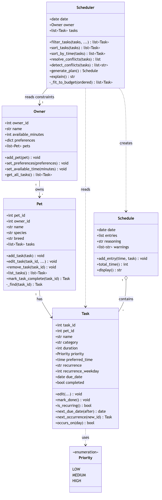

# PawPal+ (Module 2 Project)

You are building **PawPal+**, a Streamlit app that helps a pet owner plan care tasks for their pet.

## Scenario

A busy pet owner needs help staying consistent with pet care. They want an assistant that can:

- Track pet care tasks (walks, feeding, meds, enrichment, grooming, etc.)
- Consider constraints (time available, priority, owner preferences)
- Produce a daily plan and explain why it chose that plan

Your job is to design the system first (UML), then implement the logic in Python, then connect it to the Streamlit UI.

## What you will build

Your final app should:

- Let a user enter basic owner + pet info
- Let a user add/edit tasks (duration + priority at minimum)
- Generate a daily schedule/plan based on constraints and priorities
- Display the plan clearly (and ideally explain the reasoning)
- Include tests for the most important scheduling behaviors

## Getting started

### Setup

```bash
python -m venv .venv
source .venv/bin/activate  # Windows: .venv\Scripts\activate
pip install -r requirements.txt
```

### Suggested workflow

1. Read the scenario carefully and identify requirements and edge cases.
2. Draft a UML diagram (classes, attributes, methods, relationships).
3. Convert UML into Python class stubs (no logic yet).
4. Implement scheduling logic in small increments.
5. Add tests to verify key behaviors.
6. Connect your logic to the Streamlit UI in `app.py`.
7. Refine UML so it matches what you actually built.

## ✨ Features

The scheduling algorithms all live in `pawpal_system.py` and are exercised by
both the Streamlit UI (`app.py`) and the CLI demo (`main.py`):

- **Priority sorting** — orders tasks by importance (HIGH → MEDIUM → LOW), then
  by shorter duration as a tie-breaker so more work fits the budget
  (`Scheduler.sort_tasks()`).
- **Sorting by time** — arranges tasks chronologically by their preferred time
  using a zero-padded `"HH:MM"` key; untimed tasks sink to the end
  (`Scheduler.sort_by_time()`).
- **Filtering by pet, category, and status** — narrows the task list to one pet
  (by id or case-insensitive name), one category, and (optionally) completed
  tasks, while always dropping tasks that don't occur today
  (`Scheduler.filter_tasks()`).
- **Time-budget fitting** — greedily keeps the highest-priority tasks that fit
  the owner's available minutes and records anything skipped for lack of time
  (`Scheduler._fit_to_budget()`).
- **Conflict warnings** — flags overlapping time windows (labeling same-pet vs.
  different-pet clashes) as human-readable strings instead of crashing
  (`Scheduler.detect_conflicts()`).
- **Conflict resolution** — places tasks back-to-back on the clock, honoring each
  preferred time when the slot is free and bumping the loser later when it isn't
  (`Scheduler.resolve_conflicts()`).
- **Daily / weekly / weekdays recurrence** — decides whether a task is due today
  and, when a recurring task is completed, auto-creates its next instance with an
  advanced due date (`Task.occurs_on()`, `Task.next_due_date()`,
  `Task.next_occurrence()`, `Pet.mark_task_complete()`).
- **Explainable plans** — every generated schedule carries a plain-language
  rationale (counts considered/scheduled, ordering rule, skips, and any moves)
  (`Scheduler.explain()`).

## 📐 UML Diagram

The class design that the code above implements. The Mermaid source is the source
of truth ([diagrams/uml_final.mmd](diagrams/uml_final.mmd)); a rendered image is
included for convenience.



- **`Owner` → `Pet` → `Task`** form the data hierarchy (one owner, many pets, many
  tasks each).
- **`Scheduler`** holds a reference to the `Owner` (its single source of truth for
  available time and preferences), reads the candidate `Task`s, and produces a
  **`Schedule`**.
- **`Priority`** is an `IntEnum` (LOW/MEDIUM/HIGH) so tasks are directly sortable
  by importance. This should complete challenge 3.

The initial draft ([diagrams/uml.mmd](diagrams/uml.mmd)) is kept for comparison;
`uml_final.mmd` documents what was actually built (recurrence fields/methods on
`Task`, `mark_task_complete()` on `Pet`, `sort_by_time()`/`detect_conflicts()` on
`Scheduler`, `warnings` on `Schedule`, and the `Scheduler → Owner` association).

## 🖥️ Sample Output

Paste a sample of your app's CLI or Streamlit output here so a reader can see what a generated plan looks like:

```
============================================================
  TODAY'S SCHEDULE  (MONDAY, JULY 06, 2026)
  Caregiver: Jordan
============================================================
  08:00  │  Morning walk      (Biscuit, 30 min)       [HIGH]
  08:30  │  Feeding           (Biscuit, 10 min)       [HIGH]
  08:40  │  Feeding           (Mochi, 10 min)         [HIGH]
  18:00  │  Play time         (Mochi, 20 min)         [LOW]
  18:20  │  Litter cleanup    (Mochi, 15 min)         [MEDIUM]
  18:35  │  Training          (Biscuit, 20 min)       [MEDIUM]
------------------------------------------------------------
  Total scheduled time: 105 / 120 min
============================================================

Conflict warnings:
  ⚠️ Conflict (different pets): 'Feeding' for Biscuit at 08:30 overlaps 'Feeding' for Mochi at 08:30.

Why this plan:
  Considered 6 eligible task(s); scheduled 6 within a 120-minute budget (105 min used). Tasks were ordered by priority (high first), then by shorter duration to fit more in. Moved to avoid overlap: Feeding (08:30→08:40).
```


## 🧪 Testing PawPal+

Run the full suite from the project root:

```bash
python -m pytest          # run all tests

================================================= 15 passed in 0.11s =================================================


python -m pytest --cov     # optional: with coverage
```

### What the tests cover

The suite lives in `tests/test_pawpal.py` (15 tests) and targets the logic that
actually makes scheduling decisions:

- **Sorting correctness** — `sort_by_time()` returns tasks in chronological
  order (untimed tasks sink to the end), and `sort_tasks()` orders by priority
  first, shorter duration as the tie-breaker.
- **Recurrence logic** — completing a **daily** task auto-creates the next
  instance due the following day (fresh id, `completed=False`); one-off tasks
  spawn nothing; `weekdays` recurrence rolls Friday → Monday; asking a
  non-recurring task for its next occurrence raises.
- **Conflict detection** — the `Scheduler` flags two tasks at the *same* time,
  labels same-pet vs. different-pet clashes, and treats back-to-back
  (touching-but-not-overlapping) tasks as *no* conflict.
- **Conflict resolution** — when two tasks want the same slot, the second is
  bumped back-to-back and the move is recorded for the plan's explanation.
- **Budget fitting** — a zero-minute budget schedules nothing; the greedy fit
  will schedule a smaller lower-priority task when a higher-priority one is too
  big to fit.
- **Edge cases** — a pet with no tasks produces a valid, empty plan without
  crashing.

### Successful test run

```
============================= test session starts =============================
platform win32 -- Python 3.13.3, pytest-9.1.0, pluggy-1.6.0
rootdir: C:\Users\kytra\Documents\CodePath\AI110\ai110-module2show-pawpal-starter
collected 15 items

tests\test_pawpal.py ...............                                     [100%]

============================= 15 passed in 0.03s ==============================
```

### Confidence Level

**★★★★☆ (4 / 5)**

All 15 tests pass and cover the core decision-making paths — sorting, recurrence,
budget-fitting, and both conflict detection and resolution — including their
boundary cases. I'm holding back the fifth star because two known quirks are
documented-but-untested: weekly `next_occurrence()` advances by 7 days without
re-anchoring to `recurrence_weekday`, and a late task can roll past midnight and
sort to the front of the plan. Neither is exercised yet, so reliability on those
paths is unverified.

## 📐 Smarter Scheduling

PawPal+ turns a flat list of tasks into an ordered, time-budgeted, conflict-aware
daily plan. All of this logic lives in `pawpal_system.py`. The quick map:

| Feature | Method(s) | Notes |
|---------|-----------|-------|
| Sort by time | `Scheduler.sort_by_time()` | Lambda `key` on zero-padded `"HH:MM"` strings; untimed tasks sink to the end |
| Sort by priority | `Scheduler.sort_tasks()` | High priority first, then shorter duration as a tie-breaker |
| Filter by pet / status | `Scheduler.filter_tasks()` | Filter by `pet_id` or `pet_name`, by `category`, and by completion status |
| Conflict detection | `Scheduler.detect_conflicts()` | Returns warning strings for overlapping time windows; never crashes |
| Conflict resolution | `Scheduler.resolve_conflicts()` | Places tasks back-to-back and records any that were bumped |
| Recurring tasks | `Task.occurs_on()`, `Task.next_due_date()`, `Task.next_occurrence()`, `Pet.mark_task_complete()` | Daily / weekly / weekdays; completing one auto-creates the next |
| Full pipeline | `Scheduler.generate_plan()` | filter → sort → fit budget → place → explain |

### Sorting behavior

- **`Scheduler.sort_by_time()`** orders tasks chronologically. It sorts with a
  lambda `key` that renders each task's `preferred_time` as an `"HH:MM"` string —
  because hours and minutes are zero-padded, plain string comparison matches
  clock order. Tasks without a preferred time map to `"99:99"` so they sort to
  the end instead of raising on `None`.
- **`Scheduler.sort_tasks()`** orders by importance: highest `Priority` first,
  then shorter `duration` as a tie-breaker so more tasks fit into the budget.

### Filtering behavior

**`Scheduler.filter_tasks()`** is the single filtering entry point. By default it
keeps only tasks that are **not completed** and that **occur today**
(via `Task.occurs_on()`). Optional keyword arguments narrow the results further:

- `pet_id=...` or `pet_name=...` — restrict to one pet (name is case-insensitive
  and resolved to an id through the owner's pet list).
- `category=...` — restrict to one kind of task (e.g. `"feeding"`).
- `include_completed=True` — keep finished tasks, for a review/history view.

The app uses this both for the per-pet task tables and the "show completed" toggle.

### Conflict detection logic

Two methods split the work:

- **`Scheduler.detect_conflicts()`** is a lightweight, read-only check. It sorts
  the timed tasks by the same `"HH:MM"` key, then compares each task's intended
  window (`preferred_time` → `preferred_time + duration`) against the ones after
  it. Because the list is sorted, it can `break` as soon as a later task starts
  after the current one ends. It **returns a list of human-readable warning
  strings** (flagging whether the clash is for the *same pet* or *different
  pets*) rather than raising — so the UI shows a warning and the program keeps
  running. These land in `Schedule.warnings`.
- **`Scheduler.resolve_conflicts()`** actually places tasks on the clock,
  back-to-back with no overlaps, honoring each `preferred_time` when the slot is
  still free. When a preferred slot is already taken, the task is bumped later
  and the move is recorded so `explain()` can report it (e.g. `Feeding
  (08:30→08:40)`).

### Recurring task logic

Recurrence is modeled on `Task` (`recurrence`, `recurrence_weekday`, `due_date`)
and driven by three methods plus one on `Pet`:

- **`Task.occurs_on(day)`** decides whether a task is due on a given day:
  `daily` every day, `weekly` on its anchor weekday, `weekdays` Monday–Friday.
- **`Task.next_due_date(after)`** uses `datetime.timedelta` to compute the next
  occurrence accurately (handling month/year rollovers): `daily` → `after + 1
  day`, `weekly` → `after + 7 days`, `weekdays` → the next Mon–Fri.
- **`Task.next_occurrence()`** builds the follow-up task — a copy with
  `completed=False` and an advanced `due_date`.
- **`Pet.mark_task_complete(task_id)`** ties it together: it marks the task done
  and, if the task recurs, automatically creates and attaches the next instance
  (with a fresh id). One-off tasks simply complete.

## 📸 Demo Walkthrough

### The main UI (`streamlit run app.py`)

The app is a single scrolling page, top to bottom:

- **Owner settings** — edit the caregiver's name, the **available minutes** for
  today (the time budget), and the **day start time** (when the first task is
  slotted).
- **Add a pet** — a form for name, species, and breed; submitting calls
  `Owner.add_pet()`.
- **Add a task** — pick which pet it's for, then set title, category, duration,
  priority, how it repeats (one-off / daily / weekly / weekdays), and an optional
  preferred time; submitting calls `Pet.add_task()`.
- **Current pets & tasks** — a per-pet table you can **sort by Priority or Time**
  and toggle **completed tasks** on/off. A running **schedule-health banner**
  shows conflict warnings (or a green all-clear) as you edit. Each pet has a
  **Mark complete** control — completing a recurring task auto-creates its next
  instance.
- **Build today's schedule** — the primary button runs the full pipeline and
  renders the time-slotted plan, any conflict warnings, the total-vs-budget
  minutes, and a plain-language **"Why this plan"** explanation.

### Example workflow

1. Set **Available minutes** to `120` and **day start** to `08:00`.
2. **Add a pet** — `Biscuit`, a Golden Retriever dog.
3. **Add a task** for Biscuit — `Morning walk`, category *walk*, 30 min, HIGH
   priority, repeats *daily*, preferred time `08:00`.
4. **Add a second pet** (`Mochi`, a cat) and give it a `Feeding` task also at
   `08:00` — deliberately clashing.
5. Watch the **schedule-health banner** immediately flag the overlap.
6. Click **Generate schedule** and read the ordered plan: the walk keeps `08:00`,
   the feeding is bumped back-to-back, and the explanation names the move.
7. Back in **Current pets & tasks**, mark the daily walk **complete** — a fresh
   copy appears, due tomorrow.

### Key Scheduler behaviors on display

- **Priority + duration sorting** — HIGH tasks lead; equal priorities break ties
  by shorter duration.
- **Sorting by time** — the "Time" toggle and the final plan both order tasks
  chronologically, with untimed tasks last.
- **Conflict warnings** — same-time tasks are labeled *same pet* vs. *different
  pets* and surfaced without crashing.
- **Conflict resolution** — a clashing task is shifted to the next free slot and
  the move (`08:30→08:40`) is reported in the explanation.
- **Budget fitting** — only what fits `available_minutes` is scheduled; the rest
  is listed as skipped.
- **Daily recurrence** — completing the walk spawns its next instance for the
  following day.

### Sample CLI output (`python main.py`)

`main.py` builds a two-pet world (with a deliberate 08:30 feeding clash) and
prints the same logic the UI uses:

```
--- Tasks as entered (out of order) ---
    —    Training       [MEDIUM]
  08:30  Feeding        [HIGH]
  08:00  Morning walk   [HIGH]
  18:00  Play time      [LOW]
    —    Litter cleanup [MEDIUM]
  08:30  Feeding        [HIGH]

--- Sorted by TIME (lambda key on 'HH:MM') ---
  08:00  Morning walk   [HIGH]
  08:30  Feeding        [HIGH]
  08:30  Feeding        [HIGH]
  18:00  Play time      [LOW]
    —    Training       [MEDIUM]
    —    Litter cleanup [MEDIUM]

--- Sorted by PRIORITY (high first, then shorter) ---
  HIGH    Feeding        (10 min)
  HIGH    Feeding        (10 min)
  HIGH    Morning walk   (30 min)
  MEDIUM  Litter cleanup (15 min)
  MEDIUM  Training       (20 min)
  LOW     Play time      (20 min)

--- Filtered to Mochi only (by pet name) ---
  Play time      (enrichment)
  Litter cleanup (grooming)
  Feeding        (feeding)

--- Filtered to incomplete only (default) vs. including completed ---
  incomplete today: 6 | including completed: 6

============================================================
  TODAY'S SCHEDULE  (MONDAY, JULY 06, 2026)
  Caregiver: Jordan
============================================================
  08:00  │  Morning walk      (Biscuit, 30 min)       [HIGH]
  08:30  │  Feeding           (Biscuit, 10 min)       [HIGH]
  08:40  │  Feeding           (Mochi, 10 min)         [HIGH]
  18:00  │  Play time         (Mochi, 20 min)         [LOW]
  18:20  │  Litter cleanup    (Mochi, 15 min)         [MEDIUM]
  18:35  │  Training          (Biscuit, 20 min)       [MEDIUM]
------------------------------------------------------------
  Total scheduled time: 105 / 120 min
============================================================

Conflict warnings:
  ⚠️ Conflict (different pets): 'Feeding' for Biscuit at 08:30 overlaps 'Feeding' for Mochi at 08:30.

Why this plan:
  Considered 6 eligible task(s); scheduled 6 within a 120-minute budget (105 min used). Tasks were ordered by priority (high first), then by shorter duration to fit more in. Moved to avoid overlap: Feeding (08:30→08:40).

--- Recurring auto-generation ---
  Before: Biscuit has 3 task(s).
  Completed 'Morning walk' (recurrence=daily).
  Auto-created next 'Morning walk' due 2026-07-07 (id 4, completed=False).
  After:  Biscuit has 4 task(s).
```

**Screenshot or video** *(optional)*: <!-- Insert a screenshot or link to a demo video here -->
